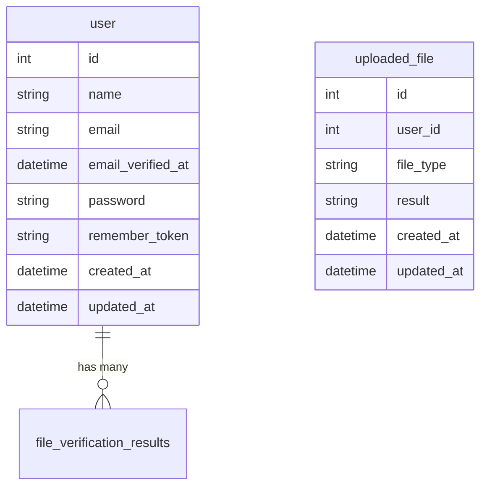
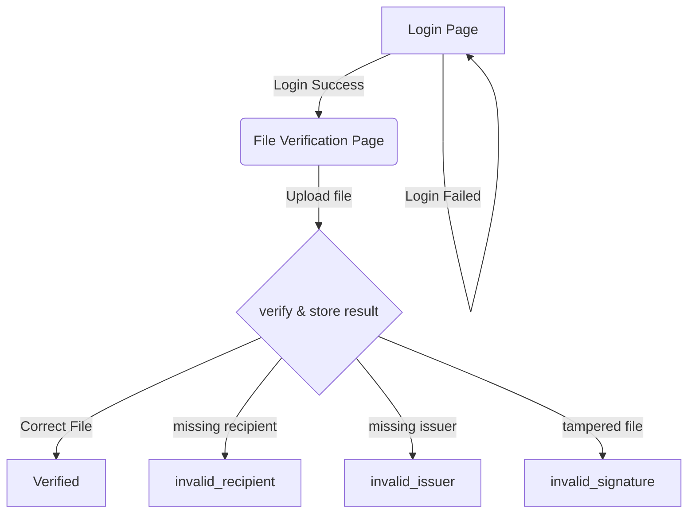

# Accredify Assessment

1. [Installation](#Installation)
2. [Entity Relation Diagram](#ERD)
3. [FlowChart](#Flowchart)
4. [Testing](#Testing)


## Installation
1. **Clone the repository:**
    ```sh
    git clone https://github.com/artisan-isaac/accredify-assessment.git
    cd accredify-assessment
    ```

2. **Install dependencies:**
    ```sh
    composer install
    ```

3. **Setup environment variables:**
    Copy the `.env.example` to `.env` and configure your database and other environment variables.
    ```sh
    cp .env.example .env
    php artisan key:generate
    ```

4. **Run migrations:**
    ```sh
    php artisan migrate --seed
    ```
    The seeding will provide user record with the credentials like below
    email    = usera@gmail.com
    password = 123123123

5. **Serve the application:**
    ```sh
    php artisan serve
    ```


## Usage
1. **Access the application:**
   Open your web browser and go to `http://localhost:8000/login`.


## ERD


## Flowchart


### Running Tests

1. **Run all tests:**
    ```sh
    php artisan test
    ```

2. **Run specific tests:**
    ```sh
    php artisan test --filter=TestClassName
    ```
